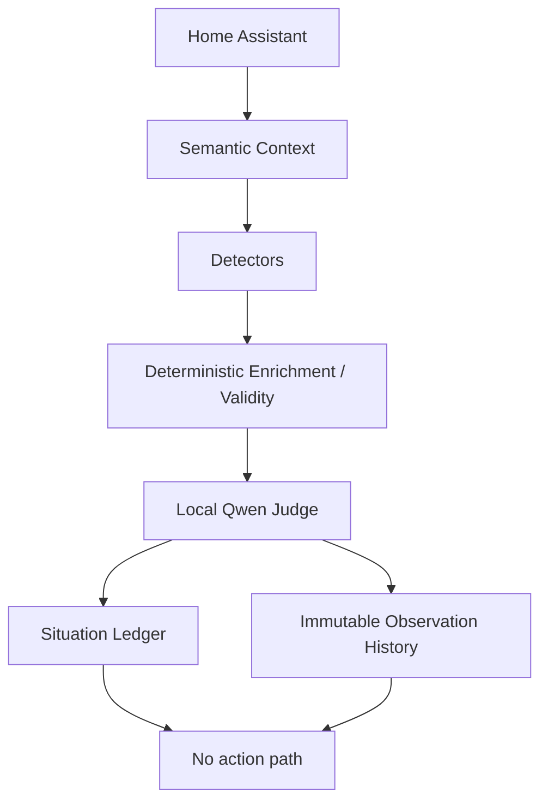

# Jarvis Core - Proactive Home AI Observer

> **Milestone 1: Autonomous Shadow Observer** - September 2026

This repository is the point where my Home Assistant / local LLM work stopped being purely reactive and started becoming something closer to the idea I have had in my head for "Jarvis": an assistant that can understand what is happening around the house, compare it with what normally happens, decide whether something is worth my attention, and eventually speak up when it is genuinely useful.

The important word there is **eventually**.

At this milestone Jarvis can observe autonomously, build semantic context, detect potentially interesting situations, use deterministic code to establish facts, ask a local Qwen model for a bounded judgement, and record the result. It **cannot act**. There is deliberately no EchoMuse/HA action path in this version.

That is not a missing feature. It is the safety boundary for this stage of the project.

## Why I built this

My existing voice stack already worked well as a reactive system:

- Home Assistant owns the physical home and exposed entities.
- EchoMuse provides local voice endpoints on rooted Echo Dot 2s.
- `jarvis-route` chooses between LOCAL / DESKTOP / CLOUD routes.
- LiteLLM provides the model gateway.
- Ollama provides always-on local inference.

What it did not do was notice things by itself.

A conventional HA automation is excellent when I already know the exact trigger and action. What I wanted to explore was the space between a rigid automation and an unconstrained AI agent. For example:

- I normally leave at roughly a certain time, but today I am still in the office.
- Tomorrow is bin day and there is no evidence that I have put the bins out.
- A calendar event is approaching and current household context makes it relevant.

The goal is not to replace Home Assistant automations with an LLM. The goal is to give Jarvis enough structured context to recognise when something *might* deserve attention, then make the interruption decision separately.

## Where this milestone landed



The observer wakes every 60 seconds. In the normal case it builds context, finds nothing noteworthy and never calls the LLM. When a detector produces a candidate, deterministic code enriches it with facts before Qwen is allowed to judge whether it should be ignored, monitored or - hypothetically - interrupted.

The result is persisted in SQLite in two forms:

1. `attention_ledger` - one mutable row for the real-world situation.
2. `attention_observations` - immutable samples showing how the judgement evolves over time.

This gives me both operational deduplication and an audit trail I can use to evaluate whether the AI is actually useful before I let it speak.

## Design principles that emerged

These were not all obvious at the start. Most came from something failing or behaving unexpectedly.

### Home Assistant remains the source of truth

Jarvis does not try to become another home-automation platform. HA owns devices, entity state, Recorder history and calendars. Jarvis consumes those abstractions.

That includes history: even though my HA Recorder is backed by MariaDB, Jarvis uses the HA history API rather than coupling itself to the database schema.

### Semantic context, not 1,300 entities in a prompt

Raw telemetry stays below the context layer. The model should see useful facts such as "user is home", "area is Office", "front entrance opened" or "calendar event starts in 10 minutes", not a dump of every HA entity.

### Bermuda owns room location

I already use Bermuda for BLE presence. I do not want Jarvis inventing a second room-location algorithm from individual Bluetooth proxy distances. Bermuda area/floor/distance are the primary abstraction; proxy distances remain supporting/debug evidence.

PIR and mmWave indicate occupancy/activity. They do **not** identify me: there are children and cats in the house.

### Deterministic facts before probabilistic judgement

This became one of the most important lessons in the project.

Early Qwen tests were allowed to infer whether a departure was late, whether I was still home and how calendar timing related to the candidate. The results were inconsistent. In one test it contradicted supplied state; in another it treated a clearly late departure as being within the historical range.

The fix was architectural, not prompt engineering:

```text
Detection -> deterministic enrichment -> validity -> LLM judgement -> policy -> action
```

Python calculates facts such as `minutes_from_typical`, `outside_historical_range` and `calendar_starts_in_minutes`. Qwen is told those facts are authoritative and only judges whether the situation deserves attention.

If required deterministic facts are missing, the candidate fails closed and never reaches Qwen.

### Detection is not interruption

A detector is allowed to say "this is potentially noteworthy". It is **not** allowed to decide that I should be interrupted.

That separation is essential if this ever becomes proactive in the real house.

### Explicit knowledge is different from learned behaviour

A repeated 15:14 departure can be learned from history. "Bins can go out after 19:00 the night before collection" is a household rule I already know.

Jarvis should not statistically relearn explicit facts. This milestone still has some domain knowledge in Python; the next milestone is to make operational household knowledge data-driven and eventually teachable conversationally.

### Absence of evidence needs an observation contract

"The door did not open" only means something if the observation source was available and the time window was valid. A future window, unavailable entity or missing history must remain **unknown**, not become false evidence.

## What is running now

Current reference deployment:

| Component | Role |
|---|---|
| Jarvis Core | Debian LXC, FastAPI, observer/context service |
| Home Assistant | State, calendars, Recorder history, semantic home boundary |
| Ollama | Local judgement inference |
| Qwen3 4B | Current judgement model |
| LiteLLM | Existing model gateway; direct Ollama is used for this milestone's component validation |
| Bermuda | Identity-linked room presence abstraction |
| EchoMuse | Existing voice endpoint; **not connected to Observer actions yet** |
| SQLite | Shadow ledger and observation history |

The reference deployment uses `Europe/London` via `zoneinfo`, not manually managed GMT/BST offsets.

## Repository layout

```text
app/
  adapters/             External-system adapters
  behaviour/            Learned behavioural models
  context/              Semantic current/history/evidence context
  judgement/            Bounded LLM judgement
  observer/
    detectors/           Candidate generation
    context.py           Bounded observer snapshot
    enrichment.py        Deterministic facts + validity contracts
    evaluator.py         Candidate -> Judge -> Ledger orchestration
    runner.py            Autonomous shadow loop
  storage/               SQLite attention ledger

docs/
  architecture.md
  development-journey.md
  testing-and-shadow-mode.md
  security-and-safety.md
  roadmap.md
  adr/                    Architecture Decision Records
examples/
  jarvis.env.example
systemd/
  jarvis-core.service
scripts/
  inspect-shadow.py
```

## API surface at this milestone

- `GET /health`
- `GET /context/home`
- `GET /context/user`
- `GET /context/calendar?days=7`
- `GET /context/history?hours=24`
- `GET /context/observer`
- `GET /observer/status`

`/context/calendar` can remain relatively rich. `/context/observer` is deliberately bounded to what matters to proactive reasoning now.

## Shadow mode

The observer runs every 60 seconds. A healthy idle system looks roughly like:

```json
{
  "running": true,
  "mode": "shadow",
  "interval_seconds": 60,
  "cycles_completed": 2,
  "last_error": null,
  "last_candidate_count": 0,
  "last_evaluation_count": 0
}
```

Zero candidates means zero Qwen calls. The normal idle path is intentionally cheap.

Even if Qwen returns `interrupt`, this milestone records:

```json
"action_taken": false
```

There is no implementation available to turn that decision into an announcement or HA action.

## Two initial detector families

### Learned routine departure deviation

HA Recorder history is correlated using physical front-door cycles and `person.steve` state transitions. A routine learner clusters corroborated departure observations by weekday/time and only exposes sufficiently recurrent patterns as actionable routines.

A candidate is generated only within a bounded window around an actionable routine. Deterministic enrichment then establishes lateness/range facts before Qwen sees it.

This was useful as the first detector because it forced the project to separate observed state, historical evidence, learned behaviour and judgement.

### Possible bins not put out

The waste calendars are already populated in HA. Jarvis calculates the preparation window (currently from 19:00 the previous evening), then checks entrance activity during the valid observation window.

No entrance activity is **evidence**, not proof, that the bins may have been forgotten. The detector therefore produces `possible_bins_not_put_out`, not `bins_not_put_out`.

This second use case proved that the architecture could combine explicit household knowledge, scheduled context and absence-of-event evidence rather than only learned routines.

## Things that went wrong - and why they mattered

This repository deliberately documents the mistakes because they shaped the architecture.

- **VMID collision:** I initially treated the main Proxmox node as the whole cluster. VMID 118 was already allocated on the secondary node. Jarvis Core became VMID 122. Lesson: cluster identity is cluster-wide.
- **HA token exposure:** a long-lived token was accidentally shown while inspecting the environment file. Secrets must never be committed; use a dedicated HA user/token and rotate exposed credentials.
- **Implicit history windows:** HA history tests over 7/28 days returned misleading slices until queries explicitly bounded both start and end.
- **Baseline history record:** the first HA Recorder record is the state at the start of the period, not necessarily a transition. Treating it as an event creates false evidence.
- **Future-window absence:** querying a future interval initially looked like "no door activity". It is actually unknown. Evidence now reports `future_window` / `evidence_available=false`.
- **LLM factual reasoning:** Qwen was too willing to derive timing/state facts itself. Those calculations moved into deterministic enrichment.
- **Malformed test candidate:** a synthetic test used a flattened schema while the real detector nests `routine` and `current`. This exposed the need for a fail-closed enrichment contract.
- **Candidate identity mismatch:** the ledger initially expected routine identity fields at the top level. The detector stored them under `routine`. Candidate identity now follows the producer schema.
- **Plausible but invented action:** Qwen proposed "send a message to your office" even though no such capability existed. This reinforced the need for a future explicit action-capability contract.

## Running locally

This is a reference homelab project rather than a one-command product installer. The current service expects Python 3, a venv, Home Assistant access and an Ollama-compatible `/api/chat` endpoint.

```bash
python3 -m venv /opt/jarvis-core/.venv
/opt/jarvis-core/.venv/bin/pip install -r requirements.txt
cp examples/jarvis.env.example /etc/jarvis-core/jarvis.env
```

Install the systemd unit, then:

```bash
systemctl daemon-reload
systemctl enable --now jarvis-core
curl -s http://127.0.0.1:8000/health | jq
curl -s http://127.0.0.1:8000/observer/status | jq
```

See `docs/deployment.md` for the fuller deployment notes.

## What this is not

This is not a general autonomous agent, a Home Assistant replacement, a generic person tracker, or a system I currently trust to operate the house without supervision.

It is a deliberately constrained context and attention engine whose decisions can be measured before actions are introduced.

## Next milestone

The next stage is not "add more hard-coded detectors". It is to make explicit household knowledge/rules data-driven so that new concepts are configured or taught rather than implemented as `bins.py`, `washing.py`, `school.py`, etc.

After that comes decision-policy/cooldown work, stronger schema validation, richer evidence correlation, and only much later a tightly whitelisted action layer.

See `docs/roadmap.md`.

## Status

**Milestone 1 complete:** autonomous shadow observation is running and producing a clean longitudinal dataset from real household context.


## Milestone 2 status (0.7.0)

Safe location-aware proactive voice is implemented behind deterministic policy and remains shadow-by-default. Controlled live delivery, situation dedupe, global cooldown, stable Bermuda room routing, deterministic resolution, and strict Qwen judgement validation have been tested. Final autonomous observer-level live validation remains before enabling normal live operation.
