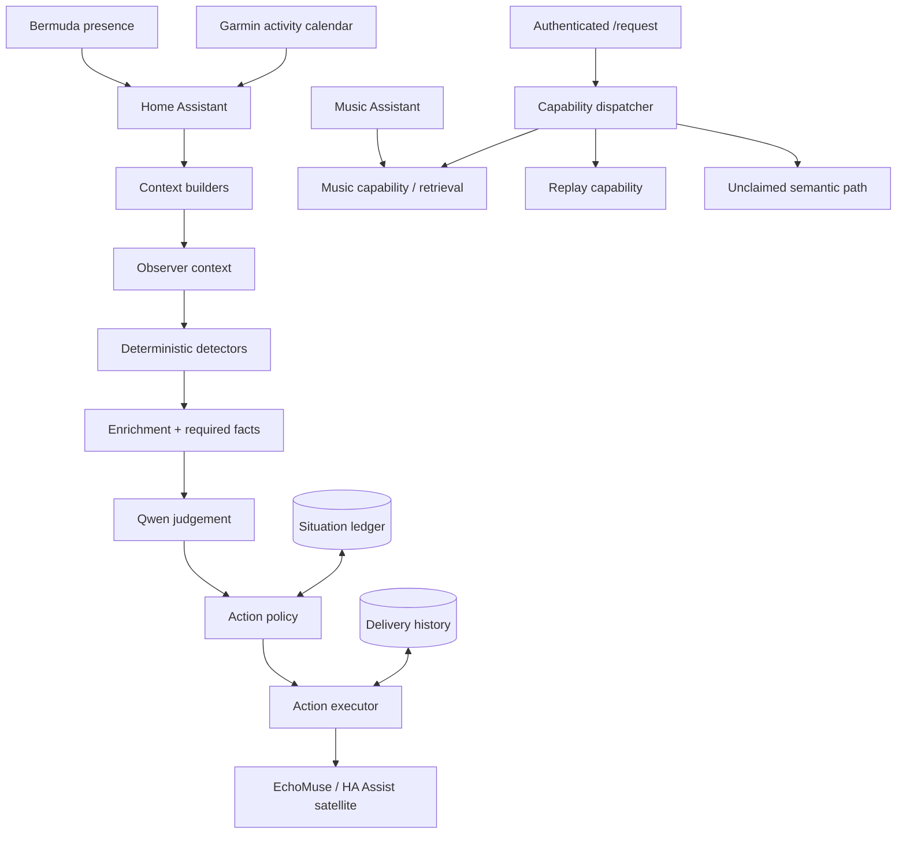

# Jarvis Core v1.1.0

Jarvis started with a logic-based multi-LLM voice router for Home Assistant. That earlier project proved the routing problem: keep native Home Assistant intents local, classify the requests that remain, choose the right LLM tier, and then call Home Assistant again so the selected conversation agent retains its own tools, entity exposure and permissions.

**That router remains a separate service and repository. Jarvis Core does not replace or absorb it.** The router owns reactive LOCAL / DESKTOP / CLOUD conversation routing; LiteLLM remains the model/API gateway; Home Assistant remains the conversation/tool authority.

**Jarvis Core is a separate application/service that sits alongside and builds on that foundation. It is the context, capability and proactive intelligence layer behind the wider Jarvis platform.**
 It consumes facts from systems that already own them, turns those facts into bounded evidence, identifies situations worth considering, and only then uses an LLM where judgement genuinely adds value.

The design principle I have kept coming back to is simple:

> **Do not make the LLM responsible for facts I can determine.**
>
> Home Assistant, Music Assistant, Garmin and Bermuda remain authoritative for their own domains. Jarvis correlates those facts. Deterministic code decides whether a situation is possible and safe. The LLM is used for the narrower question: *is this actually worth interrupting me about?*

This repository is the source and documentation for the public **Jarvis Core 1.1.0** release. The deployed build used to capture this source was internally labelled `0.7.0`; the public version line is reset here to continue forward from V1 / 1.0.0.

---

## 1. What changed since V1?

V1 was primarily a **request router**. A person spoke, Jarvis classified the request, and the correct downstream conversation agent answered it.

1.1.0 is an **application platform** around that idea. It can still receive a request, but it can also observe the home without being asked, expose bounded capabilities, retain situation and delivery lifecycle, replay an announcement, control Music Assistant through grounded retrieval, and learn an activity pattern from historical evidence.

The biggest change is therefore not another model. It is the separation of responsibilities:

```text
Authoritative systems
        ↓
Context + evidence
        ↓
Deterministic behaviour / detectors
        ↓
Enrichment + validation
        ↓
Qwen judgement
        ↓
Action policy
        ↓
Voice delivery
```

The LLM has moved **later** in the decision chain, not earlier.

See [V1 → v1.1.0](docs/v1-to-v1.1.0.md) for the detailed comparison.

---

## 2. What 1.1.0 actually does

### Proactive Observer

Observer runs continuously (60 seconds in the reference deployment), builds a current context snapshot, runs deterministic detectors and evaluates valid candidates. In live mode an `interrupt` judgement can become a voice announcement, but only after the action policy re-checks lifecycle, cooldown, presence, Bermuda room stability and the existence of an explicit voice target.

Implemented detectors include learned departure/routine situations, waste/bin preparation and learned physical-activity opportunities.

### Learned activity opportunities

1.1.0 adds the first behaviour where Jarvis learns from a durable historical source rather than relying on a hard-coded reminder.

Garmin remains authoritative for activity. Historical and new Garmin activities are represented in Home Assistant as `calendar.garmin_activities`. Jarvis reads that calendar, normalises the events, looks for qualified recurring patterns and can identify an opportunity when the current day/time, calendar, completed activity, home state and family constraints support it.

This is deliberately **not** a daily exercise quota. A gym session does not automatically satisfy a walking pattern, and walking is explicitly permitted when children are present. Other constrained activities fail closed if family state is unavailable.

### Music Assistant capability

Jarvis can handle explicit playback and bounded semantic music requests without exposing the entire music library to an LLM. Music Assistant remains authoritative for catalogue identity and playback. Semantic requests are converted into bounded retrieval policy, and the LLM never invents playable URIs.

The implemented music path covers explicit playback, genre, era, era+genre, mood/activity requests, grounded similar-artist retrieval, playback controls and origin-room targeting.

### Repeat last announcement

“Repeat that” is a deterministic capability. Jarvis retrieves the latest eligible proactive delivery, checks its age, resolves the current voice endpoint and re-delivers the exact message. A replay is itself recorded as a delivery.

### Delivery and situation history

SQLite is used for Jarvis-owned lifecycle, not as a replacement for authoritative domain data. The ledger records candidate lifecycle and announcement state. Delivery history records what Jarvis actually said, where it was delivered and the route used. Recent deliveries are exposed through `/api/notifications` and `/notifications`.

---

## 3. Architecture



The important boundaries are documented in [Architecture](docs/architecture.md).

---

## 4. Repository layout

```text
.
├── app/
│   ├── adapters/       # Home Assistant and Music Assistant boundaries
│   ├── behaviour/      # learned departures, routines and activity patterns
│   ├── capabilities/   # bounded request capabilities and dispatcher
│   ├── context/        # authoritative facts normalised for Jarvis
│   ├── judgement/      # bounded Ollama/Qwen judgement
│   ├── music/          # music intent, retrieval, policy and execution
│   ├── observer/       # detect → enrich → judge → policy → act lifecycle
│   ├── storage/        # Jarvis situation and delivery lifecycle
│   ├── voice/          # request, routing, announcements and replay
│   └── web/            # notification-history view
├── config/
│   └── jarvis.env.example
├── deployment/systemd/
│   └── jarvis-core.service
├── docs/
│   ├── architecture.md
│   ├── v1-to-v1.1.0.md
│   ├── observer.md
│   ├── capabilities.md
│   ├── music-assistant.md
│   ├── activity-intelligence.md
│   ├── data-ownership.md
│   ├── installation.md
│   ├── api.md
│   ├── testing-and-release.md
│   ├── operations.md
│   ├── roadmap.md
│   ├── lessons-learned.md
│   └── adr/
├── test_*.py
├── CHANGELOG.md
├── SECURITY.md
└── requirements.txt
```

---

## 5. Request flow versus Observer flow

These are related but different.

A request starts because somebody asked Jarvis to do something:

```text
/request
  → capability dispatcher
  → replay or music if claimed
  → otherwise wider semantic routing
```

Observer starts because the world may have changed:

```text
60-second Observer cycle
  → build current context
  → run detectors
  → enrich candidate with deterministic facts
  → reject incomplete/invalid candidates
  → ask Qwen to ignore / monitor / interrupt
  → apply action policy
  → announce only if every gate passes
```

That distinction is important. A capability owns a bounded request. A detector proposes a situation. Qwen does not get to turn an impossible situation into a possible one.

---

## 6. Authoritative data sources

Jarvis deliberately does not become a second database for everything it can see.

| Domain | Authority | Jarvis role |
|---|---|---|
| Home state/entities | Home Assistant | read and correlate |
| Room presence | Bermuda via Home Assistant | current/stable room evidence |
| Calendar commitments | HA calendar integrations | opportunity/context evidence |
| Physical activity | Garmin → HA activity calendar | learn patterns and compare today |
| Music catalogue/playback | Music Assistant | bounded retrieval and control |
| Situation lifecycle | Jarvis ledger | candidate-specific state |
| What Jarvis said | Jarvis deliveries | replay/audit history |

See [Data ownership](docs/data-ownership.md).

---

## 7. Installation

The reference deployment is a Debian LXC running FastAPI/Uvicorn under systemd. The application expects Home Assistant, Music Assistant and an Ollama-compatible judgement endpoint to exist already.

Start with [Installation](docs/installation.md), then review the reference-specific entity IDs described in [Operations](docs/operations.md). This is source from a real deployment, not a pretend generic framework; a few entity/calendar/room mappings are intentionally explicit and must be adapted for another home.

---

## 8. Testing and release confidence

1.1.0 was not promoted because one happy-path demo worked. The release gate was:

```text
Change
  → compile
  → existing Jarvis regression pack
  → ledger/lifecycle checks
  → safety/action-boundary checks
  → activity/Garmin checks
  → integration check
  → restart
  → health + Observer status
```

The release candidate completed **16/16 regression scripts successfully** before deployment. The activity-specific regression contains ten deterministic cases covering satisfaction, family constraints, calendar gaps and semantic candidate identity.

See [Testing and release](docs/testing-and-release.md).

---

## 9. What is deliberately not claimed as 1.1.0

There are several obvious next steps, but they are not silently presented as finished features:

- context-aware delivery to HA mobile notifications when away or at Work;
- durable location-history/calendar evidence for selected HA zones;
- semantic calendar commitment interpretation beyond the current bounded heuristic;
- per-calendar retrieval health rather than the current structural calendar capability;
- richer activity similarity instead of the provisional duration threshold;
- activity-specific resolver lifecycle;
- avoiding unnecessary repeated Qwen judgement for an already-announced occurrence;
- stronger isolation of regression tests from the production SQLite database;
- one authoritative application-version constant;
- multi-room/follow-me Music Assistant playback.

The roadmap is in [docs/roadmap.md](docs/roadmap.md).

---

## 10. Where the original voice router still fits

The original multi-LLM router is still an active architectural layer, not legacy code that Jarvis Core has swallowed.

For an inbound voice request, Home Assistant native intents still get the first opportunity to handle the request. Requests that need semantic routing can then pass to `jarvis-route`, which chooses LOCAL / DESKTOP / CLOUD and hands the request back to the appropriate Home Assistant conversation agent. LiteLLM remains a model/API gateway rather than the semantic router.

Jarvis Core sits alongside that reactive path. It owns context, bounded capabilities and proactive intelligence: **“what do I know, what is actually possible, is this situation meaningful, and should I say anything at all?”**

The two repositories therefore document two cooperating services in the wider Jarvis platform:

- **[HA Multi-layered LLM Voice Assistant](https://github.com/steverhysjenks/HA-multilayered-LLM-Voice-Assistant-intent-local-cloud-)** — the reactive Home Assistant voice-routing layer, including `jarvis-route`, LOCAL / DESKTOP / CLOUD model selection, LiteLLM integration and downstream Home Assistant conversation agents.
- **Jarvis Core (this repository)** — the context, capability and proactive-intelligence layer, including Observer, behaviour, Music Assistant capabilities, judgement, action policy, delivery/replay and Jarvis-owned lifecycle.

The architectural principles remain shared: Home Assistant retains authority for its tools and entities; deterministic handling should happen before probabilistic handling; and boundaries should be proven independently before they are composed.

In other words, Jarvis Core extends the wider Jarvis platform; it does not replace the voice router.
