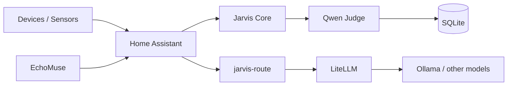
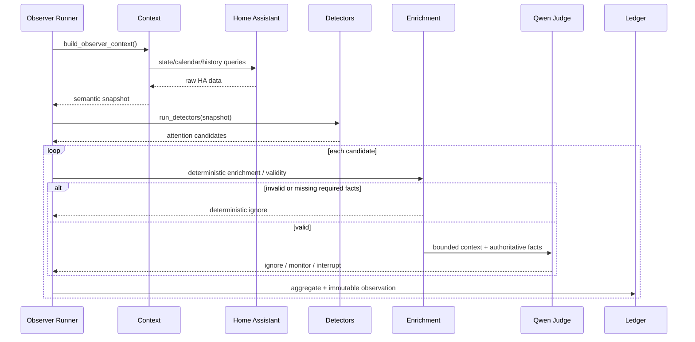

# Architecture

## Responsibility boundaries

Jarvis Core exists between Home Assistant's deterministic world model and the model layer.

The existing reactive voice path and the new proactive Observer are related but intentionally separate.

### Home Assistant
Owns device state, calendars, Recorder history, zones, people, Bermuda integration and home automations.

### Jarvis Core
Owns semantic context, targeted history interpretation, learned behavioural abstractions, attention candidate generation, deterministic enrichment, bounded judgement orchestration and shadow persistence.

### jarvis-route
Existing semantic router/orchestrator for reactive requests. It decides LOCAL / DESKTOP / CLOUD and calls HA Conversation with the selected agent.

### LiteLLM
Model/API gateway. It is not the semantic router.

### Qwen / Ollama
Inference. At this milestone the Observer Judge is validated directly against Ollama. A semantic LiteLLM alias such as `jarvis-judge` is a later integration option.

## Observer cycle

## Evidence hierarchy

Evidence is intentionally typed by what it can establish:

- Bermuda area: identity-linked estimate of where the primary user's phone is.
- `person.steve`: home/away/named HA zone.
- Front-door contact: entrance use, not identity by itself.
- PIR/mmWave: room occupancy/activity, not identity.
- Calendar: scheduled context, not proof of intent.
- Future UniFi AP association: potential coarse corroboration only.

Correlated evidence is stronger than any individual signal. For example, door cycle plus `person.steve` leaving home can become a high-confidence `user_departed` observation.

## Historical ownership

Home Assistant retains raw historical telemetry. Jarvis reads selected history through the HA API and derives compact semantic observations/routine models. It does not replicate the entire Recorder database.

## Time

All contextual/human time uses `ZoneInfo("Europe/London")`. HA event offsets are preserved. No manual BST/GMT arithmetic.

## Persistence

SQLite currently contains:

### `attention_ledger`
One row per semantic situation. Mutable latest state, first/last seen and seen count.

### `attention_observations`
Append-only judgement samples for longitudinal shadow analysis.

This split avoids choosing between deduplication and auditability.
