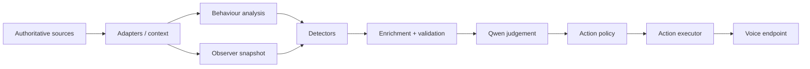

# Architecture

## The design I am aiming for

Jarvis Core should be intelligent without being vague about where facts came from.

I do not want an LLM to become a hidden database, a second Home Assistant, or a place where important household rules only exist in a prompt. The architecture therefore separates **facts**, **behaviour**, **candidate generation**, **judgement** and **action**.



## Layer 1 — authoritative sources

Home Assistant, Bermuda, Garmin-backed HA calendars and Music Assistant own domain facts. Jarvis asks them questions; it does not try to become their replacement.

`app/adapters/homeassistant.py` is the main HA REST boundary. `app/adapters/music_assistant.py` uses HA's Music Assistant services for bounded catalogue operations, while `music_assistant_native.py` handles native MA API operations needed for richer grounded retrieval.

## Layer 2 — context

`app/context/*` turns source-specific payloads into smaller semantic structures that the rest of Jarvis can reason over.

Examples:

- `home.py` — home/security mode;
- `user.py` — home state, Bermuda area, floor, stability and capability flags;
- `calendar.py` — normalised future calendar events and temporal classification;
- `history.py` / `evidence.py` — bounded HA history evidence;
- `family.py` — explicit child-presence state with UNKNOWN preserved;
- `activity.py` — Garmin activity calendar history normalised into activity observations;
- `waste.py` — collection/preparation context.

`observer/context.py` composes these in parallel into one Observer snapshot.

## Layer 3 — behaviour

Behaviour modules analyse observations but do not decide to interrupt.

`behaviour/routines.py` clusters recurring times. `behaviour/departures.py` works with departure history. `behaviour/activity.py` analyses up to 90 days of activity observations and only calls a pattern qualified when there is enough evidence, enough distinct dates and weekday spread, sufficient retention around the learned centre, and acceptable time variance.

This is evidence about behaviour, not a rule that the behaviour must happen every day.

## Layer 4 — detectors

Detectors answer: **is there a concrete situation worth considering now?**

They are deterministic. An activity candidate, for example, is only produced when the learned day/window matches, the same behaviour has not already been meaningfully completed, family policy permits it, calendar evidence is structurally available, and a large enough free interval remains.

The detector does not write “Steve should exercise”. It emits the evidence for a specific opportunity.

## Layer 5 — enrichment and validation

`observer/enrichment.py` converts context into explicit candidate facts and verifies that required facts exist. This is where the distinction between FALSE and UNKNOWN matters.

If a constrained activity requires family state and that state is unknown, Jarvis cannot reinterpret unknown as “children are not here”. Walking is an explicit exception because the policy says it is permitted with children.

## Layer 6 — judgement

`judgement/qwen.py` gives the local model a narrow job. The model receives bounded context and an already-qualified candidate, then returns a strict schema with `ignore`, `monitor` or `interrupt`, confidence, reason and optional message.

Model failure, malformed JSON or schema failure becomes a safe deterministic ignore.

The model is therefore a **judgement layer**, not the authority for deterministic facts.

## Layer 7 — action policy

`observer/action_policy.py` treats an interrupt judgement as a proposal, not permission.

The current voice action requires:

1. Observer is `live`;
2. judgement is `interrupt` with a usable message;
3. situation is not resolved or already announced;
4. global cross-situation cooldown has expired;
5. primary user is home;
6. room source is Bermuda;
7. room is stable;
8. an explicit voice target exists for that area.

This fails closed. There is no “nearest speaker” fallback if the room cannot be resolved safely.

## Layer 8 — lifecycle and delivery

`storage/ledger.py` owns situation lifecycle. `storage/deliveries.py` owns records of actual Jarvis deliveries. These are appropriate local state because they describe Jarvis itself, not a copied domain source.

Stable candidate identity is important. Activity identity includes the behaviour/day/date rather than volatile remaining free minutes, so one opportunity does not become a new situation every Observer cycle.

## Request architecture

The request path is separate from Observer:

```text
POST /request
  → voice/orchestrator.py
  → capabilities/dispatcher.py
  → replay capability
  → music capability
  → if unclaimed: semantic path
```

The dispatcher stops at the first capability that **claims** a request. This keeps domain policy bounded and prevents failed domain requests from being handed to a general semantic layer as a second attempt.

## Relationship to jarvis-route and LiteLLM

The original V1 multi-LLM router remains a separate concern. `jarvis-route` chooses LOCAL/DESKTOP/CLOUD conversation handling; LiteLLM is a model/API gateway. Jarvis Core provides context, capabilities and proactive intelligence. They can participate in the same end-to-end assistant without pretending to be the same component.
